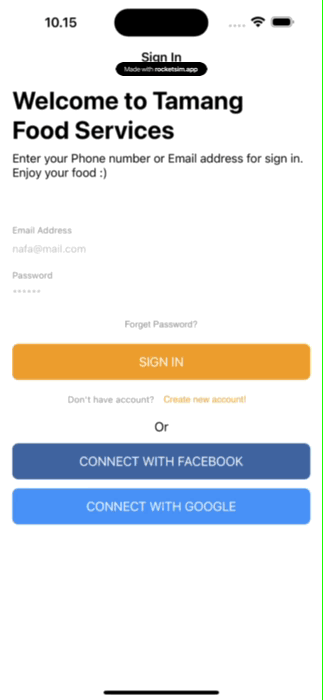
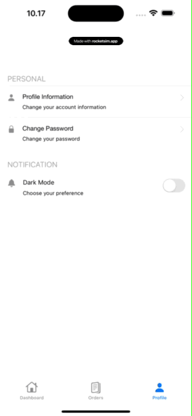

# Swift Food Ordering Application

This is a Swift-based iOS application that allows users to order food online. The application includes features like user authentication, profile management, food ordering, and payment processing.

## Screens

1. **Onboarding**
2. **Login**
3. **Forgot Password**
4. **Dashboard**
5. **Food Orders**
6. **Profile**

## Features

1. **Login**: User authentication with secure token storage in the keychain.
2. **Forgot Password**: Allows users to reset their password.
3. **Profile**: Manage user profile information.
4. **Dark/Light Mode**: Supports system-wide dark and light mode.
5. **Ordering Food**: Browse and order food items.
6. **Clear Cart**: Clear the list of food items in the cart.
7. **Payment**: Process payments for orders.
8. **Past History**: View past order history.

## Models

The application data is managed using three main models:

1. **Cart Model**: Handles the items currently in the user's cart.
2. **OrderHistory Model**: Stores past orders made by the user.
3. **Food Model**: Represents the food items available for order.

## Features & GIFs

Here are some GIFs demonstrating the application screens and features:

| Onboarding | Login | Profile | Dashboard | Food Orders |
|------------|-------|-----------------|-----------|-------------|
|  |  |  |  |  |


## Data Persistence

- **Keychain**: Used for securely storing the user authentication token.
- **CoreData Models**:
  - **Cart Model**: Persists current cart data.
  - **OrderHistory Model**: Persists past order data.
  - **Food Model**: Manages food item data.

## Requirements

- iOS 17.0+
- Xcode 13.0+
- Swift 5.0+

## Installation

Clone the repository and open the project in Xcode:

```bash
git clone https://github.com/your-username/your-repo-name.git
cd your-repo-name
open YourProjectName.xcodeproj
